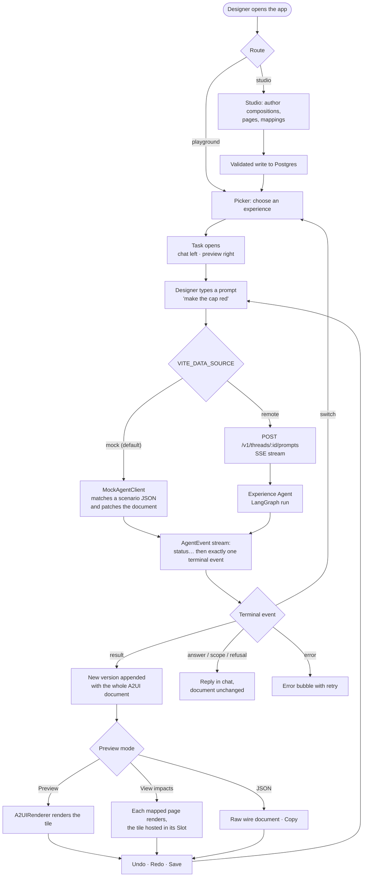
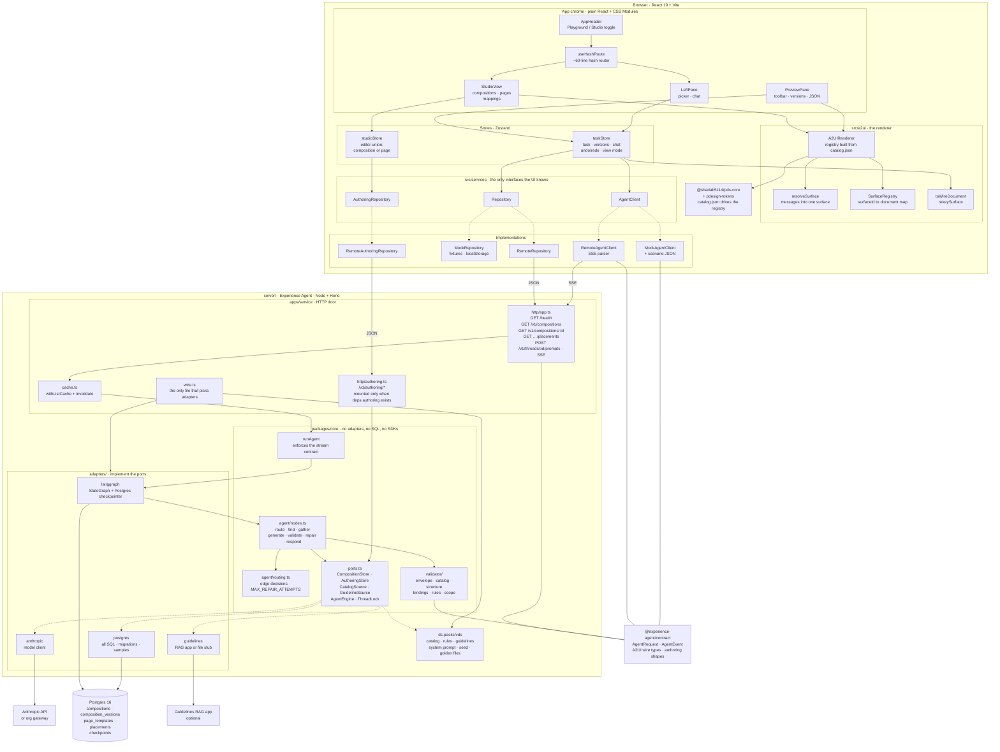
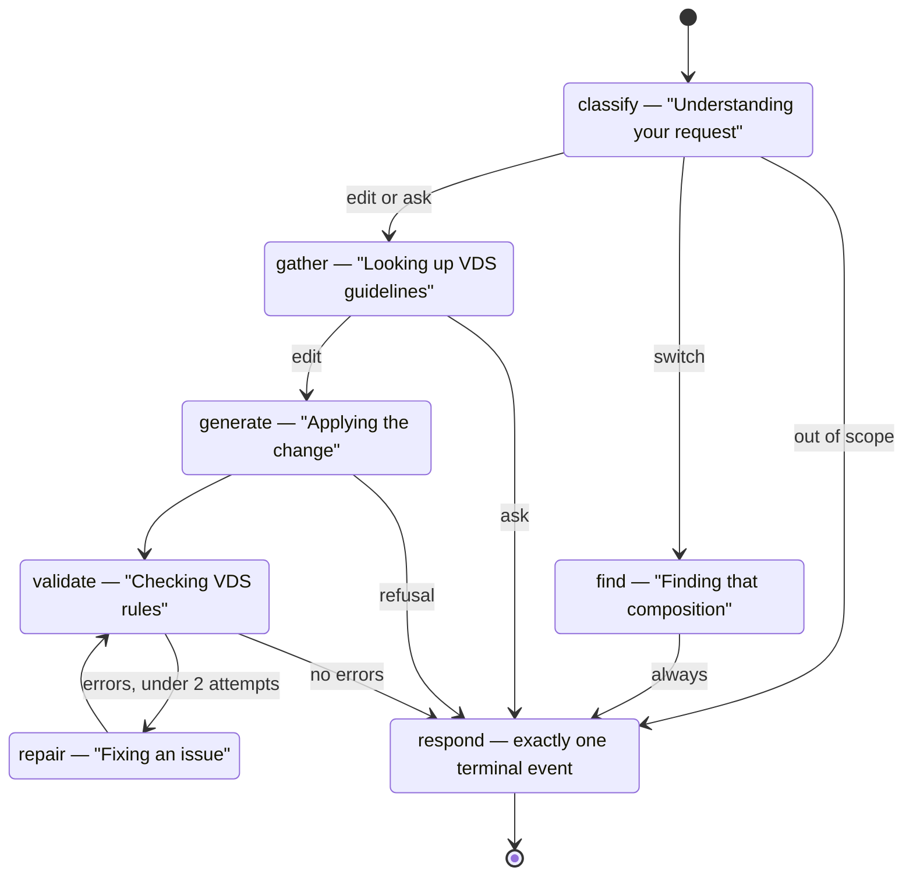

# Experience Playground

A two-pane workspace where designers pick a VDS experience, prompt an agent to
change it, and see the result rendered from A2UI JSON — including its impact on
the real pages where that experience appears.

Everything in the preview is rendered from an A2UI v0.9 document. No tile layout
is hardcoded in React, so the same document a real agent produces is the document
the browser renders, stores as a version, and shows in the JSON view.

The repo holds three things:

| Part | Where | What it is |
| --- | --- | --- |
| **Playground** | repo root (`src/`) | React 19 + Vite SPA: picker, chat, preview, impacts, Studio |
| **Experience Agent** | `server/` | Node + Hono + LangGraph + Postgres service that edits A2UI documents |
| **Shared contract** | `server/packages/contract` | `AgentRequest`, `AgentEvent`, composition and A2UI types imported by both |

Plans: [docs/PLAN.md](docs/PLAN.md) (playground),
[docs/BACKEND_PLAN.md](docs/BACKEND_PLAN.md) (service),
[docs/AUTHORING_UI_PLAN.md](docs/AUTHORING_UI_PLAN.md) (Studio).
Working rules: [CLAUDE.md](CLAUDE.md) and [server/CLAUDE.md](server/CLAUDE.md).

**Standing this up on your own design system?** Read
[docs/PORTING.md](docs/PORTING.md) and nothing else — it is a self-contained
runbook, and the plans above are background it does not need. Start with
`npm run check:catalog -- @your-org/your-core`.

---

## High-level app flow



The important invariants in that picture:

- **A `result` event always carries the whole new A2UI document, never a patch.**
  Each version is a self-contained snapshot, which is what makes undo/redo and
  the JSON view trivial.
- **Compositions are never merged into pages.** A composition placed into a page
  is its own independent A2UI surface hosted inside a `Slot` placeholder — no id
  prefixing, no data-path rewriting. See
  [docs/decisions/impact-pages-slot-hosting.md](docs/decisions/impact-pages-slot-hosting.md).
- **The UI talks to two interfaces only** — `AgentClient` and `Repository`
  (plus `AuthoringRepository` for the Studio) — and only the stores call them.
  Swapping mock for remote is one env var.

---

## Architecture



### The agent graph

Every step is an explicit node. The model never chooses which nodes run; the
conditional edges are plain, unit-tested functions in
[routing.ts](server/packages/core/src/agent/routing.ts).



Model calls happen in `classify`, `find`, `generate` and `repair` only.
`gather`, `validate` and `respond` are plain code, and **nothing reaches a
caller without passing `validate()`** — the validator engine makes no model
calls at all. A draft that still fails after two repair attempts becomes an
error rather than reaching the designer.

### Boundaries worth knowing before you edit

- `packages/core` imports no adapter, design-system pack, vendor SDK or SQL. It
  talks only to `ports.ts`.
- All SQL lives in `adapters/postgres`. The schema changes only by adding a new
  numbered migration; applied ones are never edited.
- Everything design-system specific lives in `ds-packs/vds`, seed data included.
- The contract package is the spec. The playground imports the same package, so
  changing it changes both sides at once.
- VDS (`@shadab5114/pds-core`) is required only for what the A2UI renderer
  renders. The surrounding chrome is plain modular React + CSS Modules.

---

## Running the application

### Prerequisites

| Need | Why |
| --- | --- |
| **Node 22 LTS** (20.6 or newer) | The server scripts use `node --env-file` and `--import tsx` |
| **npm 10+** | The repo is an npm workspace (`server/packages/*`, `adapters/*`, `apps/*`, `ds-packs/*`) |
| **A GitHub PAT with `read:packages`** | `@shadab5114/*` is on GitHub Packages, not public npm |
| **Docker** | Only for remote mode, to run Postgres. A local Postgres 12+ works too |
| **Google Chrome** | Only for `npm run e2e` — Playwright is pointed at the system Chrome |

### 1. Install

```sh
npm install
```

The scoped registry line lives in the project's `.npmrc`. The **token does
not** — put it in your global `~/.npmrc`, which is never committed:

```
//npm.pkg.github.com/:_authToken=<token>
```

If `npm install` fails with a 404 or 401 on `@shadab5114/*`, that token is what
is missing.

### 2. Mock mode — the default, no backend needed

```sh
npm run dev
```

Open http://localhost:5173. Everything comes from fixtures in `src/mocks/`:
four tile compositions, three page templates, and the scenario files that drive
the agent's replies. Saves go to `localStorage`.

What works here: the picker, chat with all the demo-scenario behaviours,
versions with undo/redo, Save, the JSON view and Copy, and the Impacts tabs for
`basic-plan-tile` (the only composition with mappings, so the "View impacts"
button only appears for it). The **Studio is hidden** — it writes to Postgres
and has no mock equivalent.

Prompts worth trying against the Basic Plan Tile: *"make the cap red"*, *"make
the cap purple"* (refusal with alternatives), *"make the badge smaller"*,
*"highlight the price difference"*, *"change the PDP header"* (out of scope).

### 3. Remote mode — the real agent and the Studio

**a. Configure the service.**

```sh
cp server/.env.example server/.env
```

Then edit `server/.env` and set at least `ANTHROPIC_API_KEY` and `MODEL_ID`.
`loadConfig()` validates on boot and fails with the names of the variables it
rejected — it never echoes a value, since some are keys. Leave `RAG_BASE_URL`
empty to use the file-backed guidelines stub.

**b. Start Postgres and set up the schema.**

```sh
npm run db:up        # docker compose, Postgres 16 on port 5433
npm run db:migrate   # applies server/adapters/postgres/migrations/*.sql
npm run db:samples   # imports the VDS pack's sample records
```

`db:samples` is insert-only — every statement is `on conflict do nothing`. It
restores a deleted *sample* row and leaves records you authored yourself alone.

**c. Start the service.**

```sh
npm run server:start   # or server:dev for watch mode
```

It listens on `http://localhost:8787`. Check it with
`curl http://localhost:8787/health`.

**d. Point the playground at it.**

```sh
cp .env.example .env
```

Set `VITE_DATA_SOURCE=remote` in `.env`, then:

```sh
npm run dev
```

The header now shows a **Playground / Studio** toggle, and `#/studio` opens the
authoring UI: compositions, pages and the mappings builder, all backed by
Postgres with live validation and a live `A2UIRenderer` preview. Deep links work
(`#/studio/compositions/basic-plan-tile`).

> **If a route you just added answers 404, or a `pds-core` upgrade seems not to
> take effect**, check for a stale process before debugging anything else. A dev
> server left over from an earlier session keeps serving Vite's old pre-bundled
> deps, and an old `server:start` keeps port 8787 while the new one dies with
> `EADDRINUSE` in the background. Run `netstat -ano | grep -E "5173|8787"`, kill
> the listener, and clear `node_modules/.vite`.

### 4. Tests and checks

```sh
npm run lint              # oxlint
npm run build             # tsc -b + vite build (the playground typecheck)
npm test                  # Vitest: renderer, stores, services, components
npm run server:typecheck  # tsc --noEmit over server/
npm run server:test       # Vitest: contract, core, validator, adapters
npm run e2e               # Playwright
```

Two things to know:

- **`npm run server:test` needs a test database.** `TEST_DATABASE_URL` must
  point at an existing database whose name contains `test`; the Docker setup
  creates `experience_agent_test` for you. The helper drops only the backend's
  own tables, never the schema. Live model tests are opt-in via
  `LIVE_MODEL_TESTS=1` and cost real tokens.
- **The remote and Studio e2e specs skip themselves** when nothing answers on
  8787, so `npm run e2e` is green in mock mode. They create records and clean up
  after themselves.

### Script reference

| Command | Does |
| --- | --- |
| `npm run dev` | Vite dev server on 5173 |
| `npm run build` | Typecheck + production build |
| `npm run lint` | oxlint |
| `npm run check:catalog [-- <pkg>]` | Preflight a component library for the four artifacts the port needs ([docs/PORTING.md](docs/PORTING.md)) |
| `npm test` / `npm run test:watch` | Playground unit and component tests |
| `npm run e2e` | Playwright end-to-end specs |
| `npm run server:dev` | Service with `--watch` |
| `npm run server:start` | Service on 8787 |
| `npm run server:typecheck` | Typecheck `server/` |
| `npm run server:test` | Service tests |
| `npm run db:up` / `npm run db:down` | Postgres via docker compose |
| `npm run db:migrate` | Apply migrations |
| `npm run db:samples` | Insert-only sample import |

### Playwright and browser binaries

`playwright.config.ts` points the `chromium` project at the system-installed
Chrome (`channel: 'chrome'`) rather than Playwright's own downloaded binary,
since `npx playwright install` needs network access to `cdn.playwright.dev` that
may not be available in every environment. If Chrome isn't installed locally,
run `npx playwright install chromium` once and drop the `channel` option.

---

## What is built, and what isn't

Built: the A2UI renderer and the tile fixtures, the two-pane shell and picker,
chat with the mock agent's demo behaviours, the preview toolbar (versions,
undo/redo, status pill, Save, JSON view, Copy), the Impacts view with slot
hosting, the whole backend (HTTP + SSE door, LangGraph flow, validator, Postgres
adapters, VDS pack), and the Studio S1–S8 (composition editor, page editor,
mappings builder, authored prose reaching the model).

Not built yet: the leave-task unsaved-changes warning, the dev panel and the
native tab-close prompt; action logging inside impact previews; the A2A door;
optimistic locking. [CLAUDE.md](CLAUDE.md) tracks this against the plan's
milestones and is the authoritative list.
